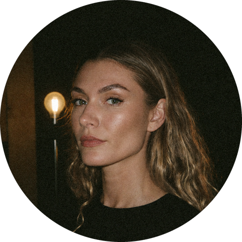

### Amber Burch

Builder, designer and systems thinker. I work across design, AI and operations.

 

I build the agents and tooling that let a small team ship studio-grade work: websites, funnels, automations, AI systems. Most of it runs inside Claude Code. The pieces that travel well end up here.

**Now**

- [flowsmith](https://github.com/amberlburch/flowsmith): an autonomous Webflow developer for Claude Code. It builds to a written definition of done and verifies every change on the published page, never the API response
- Miru, a permanent cultural listening space, opening November 2027

**Elsewhere**

- Recording and DJ work as Åtrå
- [amberburch.com](https://amberburch.com)

Yallingup, Western Australia. AWST (UTC+8).
